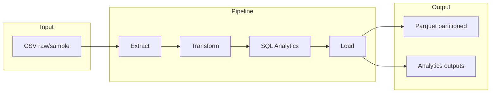

# Pharma Sales ETL Pipeline

End-to-end data pipeline built with PySpark for processing and analyzing pharmaceutical sales data (wide-format CSV with ATC drug categories). Demonstrates Extract (CSV) → Transform (unpivot, clean, features) → SQL Analytics → Load (Parquet).

## Architecture



## Tech Stack

- **PySpark** — distributed data processing, unpivot, window functions
- **SQL** — analytics via `spark.sql()` (Top 10, YoY growth, seasonality, anomalies)
- **Docker** — containerized execution
- **GitHub Actions** — CI (lint with ruff, pytest)
- **pytest** — unit and integration tests
- **Parquet** — columnar output partitioned by year/month

## Requirements

- Python 3.10+
- **Java 17** (PySpark uruchamia JVM — bez Javy: „Unable to locate a Java Runtime”)
- Optional: Docker for containerized run

### Instalacja Java 17 (macOS)

```bash
brew install openjdk@17
```

W bieżącej sesji (lub w `~/.zshrc`):

```bash
export JAVA_HOME=/opt/homebrew/opt/openjdk@17/libexec/openjdk.jdk/Contents/Home
# Intel Mac: export JAVA_HOME=/usr/local/opt/openjdk@17/libexec/openjdk.jdk/Contents/Home
```

Sprawdzenie: `java -version` → wersja 17.

## Key Analytics

- Top 10 drug categories by total sales
- Quarter-over-quarter trend (LAG)
- Seasonality: best month per category
- Year-over-Year growth per category
- Anomaly detection: days with sales > 2σ above mean

## Quick Start

### Local

```bash
pip install -r requirements.txt
python main.py --mode sample   # uses data/sample/salesdaily_sample.csv
python main.py --mode full    # uses data/raw/salesdaily.csv (must be present)
```

### Docker

```bash
docker build -t pharma-pipeline .
docker run -v $(pwd)/output:/app/output pharma-pipeline
```

Or with docker-compose:

```bash
docker compose run pipeline
```

Output is written to `output/cleaned_data/` (Parquet) and `output/analytics/` (one Parquet per query).

## Project Structure

```
pharma-sales/
├── .github/workflows/ci.yml
├── config/default.yaml
├── data/
│   ├── raw/                 # full CSV (gitignored)
│   └── sample/              # salesdaily_sample.csv (in repo)
├── output/                  # Parquet + analytics (gitignored)
├── src/
│   ├── config.py
│   ├── constants.py
│   ├── schema.py
│   ├── extract.py
│   ├── transform.py
│   ├── sql_analytics.py
│   ├── load.py
│   └── pipeline.py
├── tests/
│   ├── conftest.py
│   ├── test_extract.py
│   ├── test_transform.py
│   └── test_sql_analytics.py
├── Dockerfile
├── docker-compose.yml
├── requirements.txt
└── main.py
```

## CI/CD

Pipeline includes automated linting (`ruff check src/ tests/`) and testing (`pytest tests/`) on push and PR to `main`.

## Configuration

- `config/default.yaml`: paths (raw, sample, output), input/sample file names, Spark shuffle partitions.
- Override with `--config /path/to/config.yaml`.

## License

MIT
